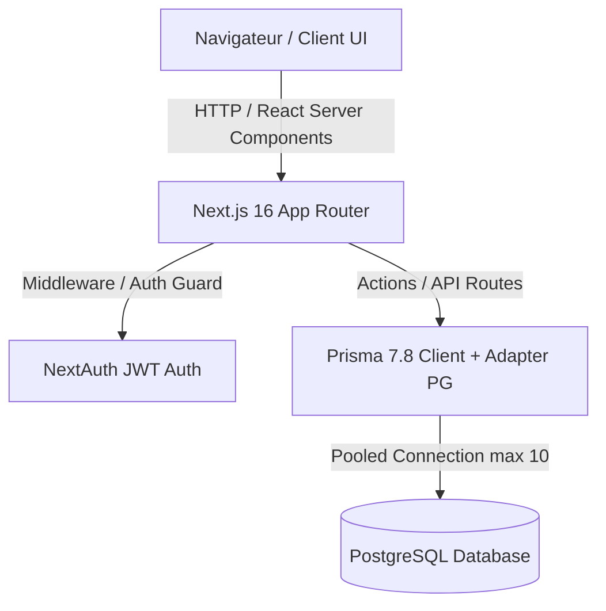

# Architecture Spine - Formation Mandarin

## Paradigm & System Model
Plateforme web d'apprentissage du mandarin basée sur **Next.js 16 App Router (React 19)**, à architecture monolithique modulaire (Server Components, API Routes, Prisma ORM avec Driver Adapter PostgreSQL, NextAuth JWT).

---

## Invariants & Architectural Decisions (ADs)

### AD-1: Web Application Framework
* **Statut :** [ADOPTED]
* **Fixe :** Next.js 16 (App Router) + React 19 + TypeScript.
* **Empêche :** Dispersion des frameworks (Express séparé, React SPA dissociée) et surcharge d'architecture.
* **Règle :** Toutes les routes UI et endpoints API doivent être résolus dans l'arborescence `src/app`.

### AD-2: Base de données & Driver Adapter PostgreSQL
* **Statut :** [ADOPTED]
* **Fixe :** Prisma 7.8.0 avec `@prisma/adapter-pg` et pool de connexion bridé (`max: 10` en production, `5` en développement).
* **Empêche :** L'épuisement des connexions PostgreSQL (`too many clients`) en environnement Serverless / Vercel.
* **Règle :** Toute requête BDD passe par l'instance singleton exportée dans [db.ts](file:///c:/Users/naoui/Desktop/Projets/formation%20mandarin/src/lib/db.ts).

### AD-3: Authentification & Gestion des Sessions Stateless
* **Statut :** [ADOPTED]
* **Fixe :** NextAuth 4.24 avec stratégie JWT stateless et adapteur Prisma.
* **Empêche :** L'exécution de requêtes BDD synchrone à chaque intercepteur de requête middleware (N+1 queries).
* **Règle :** Le callback `jwt()` dans [auth.ts](file:///c:/Users/naoui/Desktop/Projets/formation%20mandarin/src/lib/auth.ts) reste pur et léger sans appel BDD synchrone. Le rafraîchissement se fait par `update()` de la session ou webhook.

### AD-4: Modèle de Données & RBAC (Rôles & Abonnements)
* **Statut :** [ADOPTED]
* **Fixe :** Rôles `USER` / `ADMIN`, progression par clé unique `(userId, lessonId)`, et modèle `Subscription` enrichi pour l'intégration de passerelles de paiement (Stripe).
* **Empêche :** L'accès non autorisé aux leçons protégées.
* **Règle :** Le rôle `ADMIN` donne accès d'office à l'ensemble du contenu. La vérification RBAC des leçons s'effectue au niveau de [middleware.ts](file:///c:/Users/naoui/Desktop/Projets/formation%20mandarin/src/middleware.ts).

### AD-5: Design System & Styling
* **Statut :** [ADOPTED]
* **Fixe :** Tailwind CSS v4 + Vanilla CSS.
* **Empêche :** Le mélange de bibliothèques CSS concurrentes (Styled Components, Emotion).
* **Règle :** L'interface doit être réactive, moderne et accessible avec une hiérarchie visuelle claire.

---

## Élément Différés (Deferred Items)

1. **Fournisseur de Streaming Vidéo :** Sélection du service vidéo final (Bunny Stream, Cloudflare Stream, Mux) pour remplacer les liens bruts `videoUrl`.
2. **Endpoints Webhook Stripe :** Implémentation de `/api/webhooks/stripe` pour la synchronisation automatique des statuts d'abonnement.
